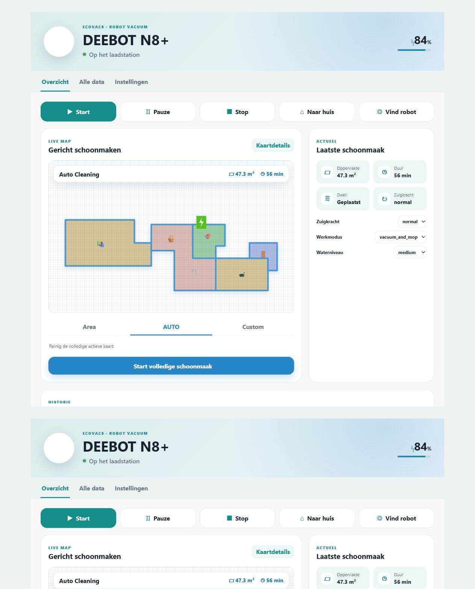

# Robot Vacuum Dashboard

Een complete, responsieve Home Assistant-dashboardkaart voor robotstofzuigers. De kaart is ontwikkeld rond de officiële **Ecovacs**-integratie en de DEEBOT N8+, maar gebruikt de standaard Home Assistant `vacuum`-acties en werkt daardoor ook met andere merken.




## Functies

- Eén kaart met overzicht, alle data en instellingen
- Starten, pauzeren, stoppen, terugsturen en lokaliseren
- Live kaart via een `image.*`- of `camera.*`-entiteit
- Optionele gekleurde, gelabelde en rechtstreeks selecteerbare Ecovacs-kamers
- Accu, status, fouten, laatste beurt en totalen
- Filter-, hoofd- en zijborstelonderhoud
- Zuigkracht, werkmodus en waterniveau
- Eén of meerdere gekoppelde Home Assistant-ruimtes reinigen
- Opgeslagen vrije Ecovacs-zones reinigen via coördinaten
- Ondersteunde Ecovacs-schakelaars, zoals tapijtboost en doorlopend reinigen
- Automatische herkenning van bijbehorende entiteiten
- Handmatige overrides via de ingebouwde visuele editor
- Geen Mushroom, card-mod of andere frontend-afhankelijkheden
- Automatische ondersteuning voor lichte en donkere Home Assistant-thema's

## Vereisten

- Home Assistant 2024.2 of nieuwer wordt aanbevolen.
- Minimaal één `vacuum.*`-entiteit.
- Voor Ecovacs: **Instellingen → Apparaten & diensten → Integratie toevoegen → Ecovacs**.

De oude `And3rsL/Deebot-for-Home-Assistant` custom component is gearchiveerd. De opvolger is sinds Home Assistant 2024.2 opgenomen in Home Assistant Core.

## Installeren via HACS

Tot de repository in de standaard HACS-catalogus is opgenomen:

1. Open **HACS → Frontend**.
2. Open het menu rechtsboven en kies **Aangepaste repositories**.
3. Voeg toe:

   ```text
   https://github.com/ju1ced/robot-vacuum-dashboard
   ```

4. Kies categorie **Dashboard**.
5. Installeer **Robot Vacuum Dashboard**.
6. Vernieuw de browser volledig.

HACS hoort de volgende Lovelace-resource automatisch te registreren:

```yaml
url: /hacsfiles/robot-vacuum-dashboard/robot-vacuum-dashboard.js
type: module
```

## Kaart toevoegen

Open een dashboard, kies **Bewerken → Kaart toevoegen → Robot Vacuum Dashboard** en selecteer je robot in de visuele editor.

De minimale YAML-configuratie is:

```yaml
type: custom:robot-vacuum-dashboard-card
entity: vacuum.deebot_n8_plus
name: DEEBOT N8+
```

De kaart zoekt automatisch naar entiteiten waarvan de object-id of zichtbare naam overeenkomt met de gekozen robot. Controleer na de eerste keer openen of de kaart, statistieken en instellingen correct zijn herkend.

## Interactieve Ecovacs-kaart

De officiële Ecovacs-integratie ontvangt kamercoördinaten van `deebot-client`, maar publiceert die momenteel niet als Home Assistant-attributen. De optionele companion-integratie **Ecovacs Map Data** maakt die lokale eventgegevens beschikbaar als `sensor.*_map_geometry`.

Met die sensor kan de kaart:

- iedere kamer afzonderlijk inkleuren;
- kamernamen boven de live kaart plaatsen;
- een kamer rechtstreeks op de kaart selecteren;
- de geselecteerde Home Assistant-ruimte via `vacuum.clean_area` reinigen.

De companion-bron staat voorlopig in [`companion/ecovacs-map-data`](companion/ecovacs-map-data) en wordt als afzonderlijke HACS-integratie gepubliceerd. Zonder companion blijft de bestaande live kaart en kamerkeuze volledig werken.

## Handmatige entiteitstoewijzing

Als Ecovacs andere namen heeft aangemaakt, open je de kaarteditor en klap je **Handmatige entiteitstoewijzing** open. Of gebruik YAML:

```yaml
type: custom:robot-vacuum-dashboard-card
entity: vacuum.deebot_n8_plus
name: DEEBOT N8+
confirm_actions: true
show_map: true
show_details: true
entities:
  map: image.deebot_n8_plus_map
  map_geometry: sensor.deebot_n8_plus_map_geometry
  mop_attached: binary_sensor.deebot_n8_plus_mop_attached
  cleaning_area: sensor.deebot_n8_plus_cleaning_cycle_area
  cleaning_time: sensor.deebot_n8_plus_cleaning_cycle_time
  total_area: sensor.deebot_n8_plus_total_statistics_area
  total_time: sensor.deebot_n8_plus_total_statistics_time
  total_cleanings: sensor.deebot_n8_plus_total_statistics_cleanings
  water_level: select.deebot_n8_plus_water_level
  work_mode: select.deebot_n8_plus_work_mode
  clean_count: number.deebot_n8_plus_clean_count
  error: sensor.deebot_n8_plus_error
  main_brush: sensor.deebot_n8_plus_main_brush_lifespan
  side_brush: sensor.deebot_n8_plus_side_brush_lifespan
  filter: sensor.deebot_n8_plus_filter_lifespan
```

Alle mappings zijn optioneel. Onderhoudswaarden vallen automatisch terug op de `component_brush`, `component_side_brush` en `component_filter` attributen van de vacuümentiteit.

## Configuratie

| Optie | Standaard | Beschrijving |
|---|---:|---|
| `entity` | vereist | De primaire `vacuum.*`-entiteit |
| `name` | Robotstofzuiger | Titel bovenaan de kaart |
| `confirm_actions` | `true` | Vraagt bevestiging voor starten, stoppen en terugsturen |
| `show_map` | `true` | Toont of verbergt het kaartpaneel |
| `show_details` | `true` | Toont totalen en onderhoud |
| `entities` | `{}` | Optionele handmatige entiteitstoewijzingen |

## Ecovacs-entiteiten activeren

Welke entiteiten beschikbaar zijn, hangt af van het model. Open **Instellingen → Apparaten & diensten → Ecovacs → je robot**. Sommige entiteiten zijn standaard uitgeschakeld, waaronder fout-, netwerk- en onderhoudsresetentiteiten. Activeer alleen wat je nodig hebt.

## Ruimtes reinigen

Home Assistant ondersteunt op geschikte modellen `vacuum.clean_area`. Koppel eerst de Ecovacs-segmenten via de instellingen van de vacuümentiteit onder **Vacuümsegmenten aan ruimtes koppelen**. Voeg daarna in de kaarteditor regels toe met `Naam | area-ID | icoon`:

```text
Keuken|kitchen|mdi:silverware-fork-knife
Woonkamer|living_room|mdi:sofa
Hal|hallway|mdi:coat-rack
```

De kaart laat één of meerdere kamers selecteren en verstuurt ze samen via `cleaning_area_id` naar de officiële Home Assistant-actie.

## Opgeslagen vrije zones

Vrije zones gebruiken Ecovacs-kaartcoördinaten. Voeg ze in de editor toe als `Naam | x1,y1,x2,y2 | icoon`:

```text
Onder eettafel|-1339,-1511,296,-2587|mdi:table-furniture
Rond de bank|250,600,1450,-400|mdi:sofa
```

De kaart gebruikt standaard het Ecovacs-commando `custom_area`. Dit is een reverse-engineered, modelspecifieke functie. Test elke zone eerst terwijl je bij de robot bent. Als jouw integratie of model een ander commando verwacht, kun je `region_command` aanpassen.

Zonder de optionele companion-integratie gebruikt de kaart de afgewerkte `image.*`- of `camera.*`-entiteit. Met Ecovacs Map Data worden de originele Ecovacs-subsetcoördinaten als SVG-lagen boven de kaart geplaatst.

## Problemen oplossen

- **Kaart ontbreekt:** wijs de juiste `image.*`- of `camera.*`-entiteit handmatig toe.
- **Een waarde ontbreekt:** controleer op de Ecovacs-apparaatpagina of die entiteit bestaat en actief is.
- **Oude kaart na update:** vernieuw de browser volledig en controleer of maar één resource naar `robot-vacuum-dashboard.js` verwijst.
- **Robot niet gevonden:** controleer of `entity` met `vacuum.` begint.
- **Commando werkt niet:** test hetzelfde commando eerst via Ontwikkelaarstools → Acties.

## Ontwikkeling

De HACS-distributie is het ongecompileerde bestand `robot-vacuum-dashboard.js`; er is geen buildstap nodig.

```bash
npm run check
npm test
```

## Licentie

[MIT](LICENSE)
